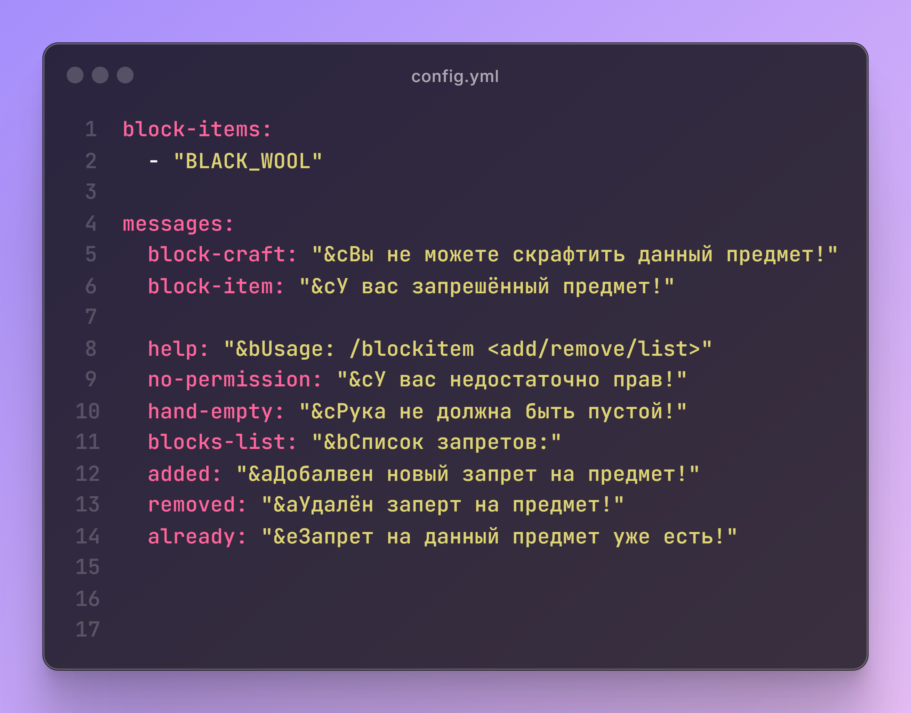

# BlockItem 🚫​
Простой плагин для запрета блоков/предметов игрокам!

## 🧪Основные функции:​
- 🚫 Запрет на крафт​
- ✋ Запрет на подбор​
- 🔫 Автоматическое удаления запрещённого предмета из инвентаря​<br>
- 📑 Сообщения в чат при попытке крафта или получения запрещённого предмета​<br>
- ✨ Возможность быстро добавлять/удалять запреты на предметы​<br>
​
## 💻 Команды:​
- ```/blockitem add``` - добавить предмет из руках в заперт​ <br>
- ```/blockitem remove``` - убрать предмет в руках из запрета (нужны права: blocktime.bypass)​<br>
- ```/blockitem list``` - показать список предметов из запрета​<br>

## 📕 Права:​
- ```blockitem.bypass``` - игнорировать запрет​<br>
- ```blockitem.add``` - добавить предмет в запрет​<br>
- ```blockitem.remove``` - убрать предмет из запрета​<br>
- ```blockitem.list``` - показать список предметов из запрета​<br>

📦 Минимальные требования:​
- ☕ ```Java 17+​```
- 🧩 ```Paper 1.18.2+​```

📄 Конфиг:​


сделал всё: localhost
discord: ```#only_localhost``` || telegram: ```@local_explorer```
